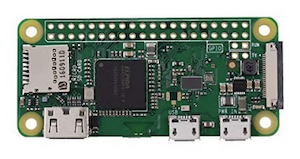

# Mosquitto and Zigbee2MQTT on a Raspberry Pi Zero W with a ZBDongle-E

This is a guide on how to set up a Raspberry Pi Zero W with a ZBDongle-E to run Mosquitto and Zigbee2MQTT.

My initial goal (as of January 2025) was to get MQTT running and connect an [IKEA Parasoll](https://www.ikea.com/se/en/p/parasoll-door-window-sensor-smart-white-80504308/) to it to be able to monitor door/window open status.




## Install the OS

  todo

## Install Mosquitto

```bash
sudo apt update && sudo apt upgrade
sudo apt install mosquitto mosquitto-clients
sudo systemctl enable mosquitto.service
```

```bash
cat <<EOF | sudo tee -a /etc/mosquitto/mosquitto.conf
listener 1883
allow_anonymous true
EOF
sudo systemctl restart mosquitto.service
```

## Install The dongle

## Flash the newest coordinator firmware

https://darkxst.github.io/silabs-firmware-builder/#zbdongle-e

I've used this online flasher, which worked good in Chrome. I've updated to `7.4.4`.

Before the firmware update, I was getting the below when starting up Zigbee2MQTT:
```
Error: SRSP - SYS - ping after 6000ms
```
and/or
```
Adapter EZSP protocol version (8) is not supported by Host [13-16]
```

## Install Zigbee2MQTT

Need to use unofficial builds since I am running on ARMv6l (Raspberry Pi Zero W). Official builds have stopped supporting it around v14 I think.

```bash
wget https://unofficial-builds.nodejs.org/download/release/v20.14.0/node-v20.14.0-linux-armv6l.tar.gz
tar xzvf node-v20.14.0-linux-armv6l.tar.gz
cd node-v20.14.0-linux-armv6l/
sudo cp -R * /usr/local/
node -v # Should say v20.14.0
```

```bash
sudo git clone --depth 1 https://github.com/Koenkk/zigbee2mqtt.git /opt/zigbee2mqtt
sudo chown -R janbrucek:janbrucek /opt/zigbee2mqtt/
cd /opt/zigbee2mqtt/
python3 -m venv .
source /opt/zigbee2mqtt/bin/activate
pip install --upgrade pip wheel setuptools
npm install -g pnpm
deactivate
source /opt/zigbee2mqtt/bin/activate
pnpm i --frozen-lockfile
cp /opt/zigbee2mqtt/data/configuration.example.yaml /opt/zigbee2mqtt/data/configuration.yaml
vi /opt/zigbee2mqtt/data/configuration.yaml
pnpm start
```

### Optionally, run it as a service

```bash
cat <<EOF | sudo tee -a /etc/systemd/system/zigbee2mqtt.service
[Unit]
Description=zigbee2mqtt
After=network.target

[Service]
Environment=NODE_ENV=production
Type=exec
ExecStart=/usr/local/bin/node index.js
WorkingDirectory=/opt/zigbee2mqtt
StandardOutput=inherit
StandardError=inherit
# This is for the long startup time on the Raspberry Pi Zero W
TimeoutStartSec=300s
Restart=always
RestartSec=10s
User=${USER}

[Install]
WantedBy=multi-user.target
EOF

sudo systemctl enable zigbee2mqtt.service
sudo journalctl -u zigbee2mqtt.service -f
```

### To potentially update (untested by me)

```bash
# Run the update script from the Zigbee2MQTT directory
cd /opt/zigbee2mqtt
./update.sh
```

## Mac OS Client

```bash
brew install mosquitto
```
